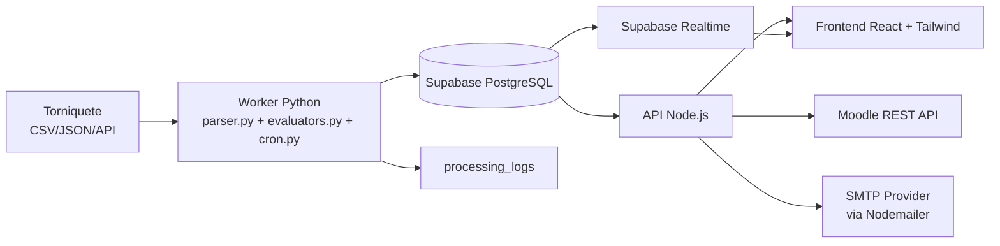
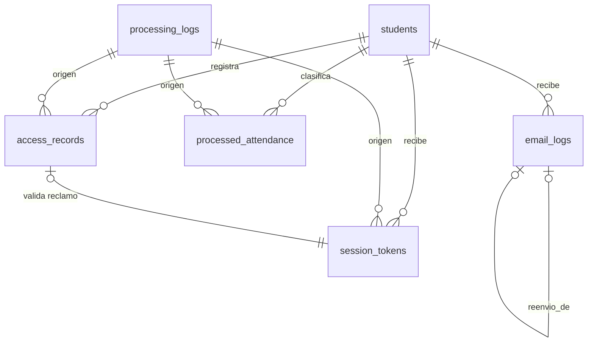
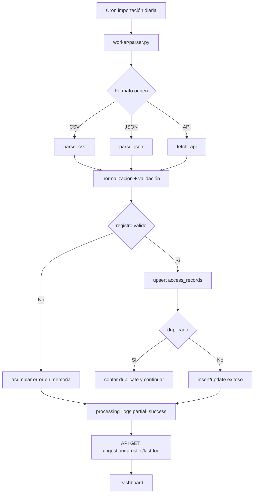
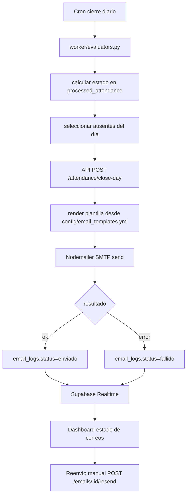
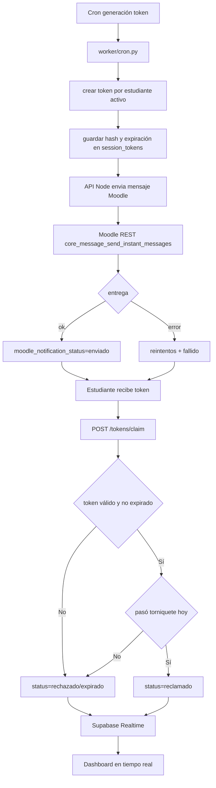
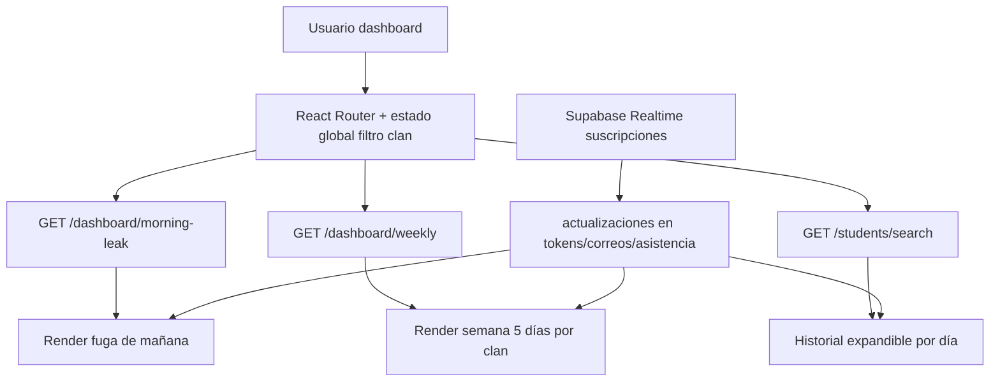

# ARCHITECTURE.md — Proyecto Pegasus

## 1. Visión general del sistema

Pegasus es un sistema de control de asistencia estudiantil orientado a operación diaria, con trazabilidad completa desde la captura de eventos del torniquete hasta la visualización en dashboard y la comunicación a estudiantes por correo y Moodle. La arquitectura se basa en Supabase como plataforma de datos y tiempo real, un API REST en Node.js para exponer operaciones al frontend y un servicio Python para ingestión, evaluación de reglas de negocio y tareas programadas.

El flujo operativo diario inicia con la importación automática de eventos de acceso (EP-01). El parser Python procesa archivos/entradas del torniquete, normaliza registros y persiste resultados en Supabase con tolerancia a duplicados y corrupción parcial. Ningún error de fila detiene el lote completo; cada ejecución queda auditada en `processing_logs` y el último estado es consultable por dashboard.

Al cierre del día (EP-02), el motor de evaluación clasifica asistencia por estudiante y fecha (`presente`, `ausente`, `edificio_fuera_aula`). Con esta salida, se dispara envío de correos automáticos de ausencia mediante Nodemailer (integrado en el API Node.js), registrando estado por intento en `email_logs`. El dashboard permite reenvío manual de correos fallidos o pendientes.

Para sesiones con token (EP-03), Python genera token único por estudiante en ventana horaria configurable, el API Node.js envía notificación a Moodle vía REST y persiste el estado de entrega. Cuando el estudiante reclama token, la validación cruza existencia de acceso en torniquete del día antes de aceptar. El frontend React (EP-04) consume API para vistas agregadas y usa Supabase Realtime para actualización sin recarga de cambios en asistencia, correos, tokens y procesamiento.



> ⚠️ PENDIENTE: Confirmar formato final de exportación del torniquete (CSV, JSON o API directa), zona horaria oficial de operación y hora exacta de cierre académico para consolidación diaria.

## 2. Stack tecnológico

| Capa | Tecnología | Versión sugerida | Rol en el sistema |
|---|---|---:|---|
| Base de datos | Supabase (PostgreSQL) | PostgreSQL 15 (gestionado por Supabase) | Persistencia transaccional de estudiantes, accesos, asistencia, tokens, correos y logs |
| Autenticación | Supabase Auth | Última estable | Emisión/validación de JWT para acceso al API y dashboard |
| Tiempo real | Supabase Realtime | Última estable | Suscripciones de cambios para dashboard sin recarga |
| Storage | Supabase Storage | Última estable | Almacenamiento opcional de archivos crudos de torniquete y evidencias de procesamiento |
| Backend API | Node.js + Express | Node 20 LTS, Express 4.x | Endpoints REST para frontend, orquestación de correo y Moodle |
| Correo | Nodemailer | 6.x | Envío de correos automáticos y reenvíos manuales |
| Procesamiento | Python | 3.12 | Parser del torniquete, evaluadores de asistencia, cron jobs |
| Programación de tareas | Supercronic (en contenedor Python) | 0.2.x | Ejecución de tareas programadas por variables CRON |
| Frontend | React + Vite + Tailwind CSS | React 18.x, Vite 5.x, Tailwind 3.x | Dashboard operativo (fuga de mañana, semana, filtros, búsqueda, estados) |
| Integración LMS | Moodle REST API | Compatible con Moodle 4.x | Envío de tokens y notificaciones a estudiantes |
| Infraestructura contenedores | Docker | 26+ | Empaquetado y ejecución de servicios |
| Orquestación local | docker-compose | v2.24+ | Levantar entorno completo local/dev |

## 3. Servicios y contenedores Docker

### Contenedores

| Servicio | Imagen base | Puerto host:contenedor | Volúmenes | Dependencias |
|---|---|---|---|---|
| `api` | `node:20-alpine` | `3000:3000` | `./services/api:/app`, `/app/node_modules` | `worker`, `mailhog` (solo dev) |
| `worker` | `python:3.12-slim` | `8081:8081` (health opcional) | `./services/worker:/app` | `mailhog` (solo dev) |
| `frontend` | `node:20-alpine` | `5173:5173` | `./services/frontend:/app`, `/app/node_modules` | `api` |
| `mailhog` (dev) | `mailhog/mailhog:v1.0.1` | `8025:8025`, `1025:1025` | Sin volumen obligatorio | Ninguna |

### `docker-compose.yml`

```yaml
version: "3.9"

services:
  api:
    build:
      context: ./services/api
      dockerfile: Dockerfile
    container_name: pegasus-api
    command: sh -c "npm install && npm run dev"
    ports:
      - "3000:3000"
    environment:
      NODE_ENV: development
      PORT: 3000
      SUPABASE_URL: ${SUPABASE_URL}
      SUPABASE_SERVICE_ROLE_KEY: ${SUPABASE_SERVICE_ROLE_KEY}
      SUPABASE_ANON_KEY: ${SUPABASE_ANON_KEY}
      JWT_AUDIENCE: ${JWT_AUDIENCE}
      JWT_ISSUER: ${JWT_ISSUER}
      SMTP_HOST: ${SMTP_HOST:-mailhog}
      SMTP_PORT: ${SMTP_PORT:-1025}
      SMTP_USER: ${SMTP_USER:-}
      SMTP_PASS: ${SMTP_PASS:-}
      SMTP_SECURE: ${SMTP_SECURE:-false}
      EMAIL_FROM: ${EMAIL_FROM}
      MOODLE_BASE_URL: ${MOODLE_BASE_URL}
      MOODLE_TOKEN: ${MOODLE_TOKEN}
      MOODLE_WS_FORMAT: json
      APP_TIMEZONE: ${APP_TIMEZONE:-America/Lima}
      TOKEN_TTL_MINUTES: ${TOKEN_TTL_MINUTES:-15}
    volumes:
      - ./services/api:/app
      - /app/node_modules
    depends_on:
      - worker
      - mailhog
    restart: unless-stopped

  worker:
    build:
      context: ./services/worker
      dockerfile: Dockerfile
    container_name: pegasus-worker
    command: sh -c "pip install -r requirements.txt && supercronic /app/crontab"
    ports:
      - "8081:8081"
    environment:
      PYTHONUNBUFFERED: "1"
      SUPABASE_URL: ${SUPABASE_URL}
      SUPABASE_SERVICE_ROLE_KEY: ${SUPABASE_SERVICE_ROLE_KEY}
      TURNSTILE_SOURCE_TYPE: ${TURNSTILE_SOURCE_TYPE:-csv}
      TURNSTILE_SOURCE_PATH: ${TURNSTILE_SOURCE_PATH:-/app/data/inbox/turnstile.csv}
      TURNSTILE_API_URL: ${TURNSTILE_API_URL:-}
      TURNSTILE_API_TOKEN: ${TURNSTILE_API_TOKEN:-}
      APP_TIMEZONE: ${APP_TIMEZONE:-America/Lima}
      CRON_TURNSTILE_IMPORT: ${CRON_TURNSTILE_IMPORT:-5 7 * * 1-5}
      CRON_TOKEN_GENERATION: ${CRON_TOKEN_GENERATION:-50 7 * * 1-5}
      CRON_DAY_CLOSE: ${CRON_DAY_CLOSE:-10 18 * * 1-5}
      TOKEN_TTL_MINUTES: ${TOKEN_TTL_MINUTES:-15}
      API_INTERNAL_BASE_URL: ${API_INTERNAL_BASE_URL:-http://api:3000}
      INTERNAL_API_TOKEN: ${INTERNAL_API_TOKEN}
    volumes:
      - ./services/worker:/app
    depends_on:
      - mailhog
    restart: unless-stopped

  frontend:
    build:
      context: ./services/frontend
      dockerfile: Dockerfile
    container_name: pegasus-frontend
    command: sh -c "npm install && npm run dev -- --host 0.0.0.0 --port 5173"
    ports:
      - "5173:5173"
    environment:
      VITE_API_BASE_URL: ${VITE_API_BASE_URL:-http://localhost:3000}
      VITE_SUPABASE_URL: ${SUPABASE_URL}
      VITE_SUPABASE_ANON_KEY: ${SUPABASE_ANON_KEY}
      VITE_APP_TIMEZONE: ${APP_TIMEZONE:-America/Lima}
    volumes:
      - ./services/frontend:/app
      - /app/node_modules
    depends_on:
      - api
    restart: unless-stopped

  mailhog:
    image: mailhog/mailhog:v1.0.1
    container_name: pegasus-mailhog
    ports:
      - "8025:8025"
      - "1025:1025"
    restart: unless-stopped
```

## 4. Modelo de datos (Supabase / PostgreSQL)

### Definiciones de tablas y relaciones

- `students`: maestro de estudiantes y vínculo con Moodle.
- `processing_logs`: bitácora por ejecución (importación, evaluación, token, envío).
- `access_records`: eventos crudos/normalizados del torniquete.
- `processed_attendance`: resultado diario por estudiante.
- `session_tokens`: token diario por estudiante con estado y trazabilidad de reclamo/entrega Moodle.
- `email_logs`: trazabilidad de envíos de correo automáticos y reintentos manuales.

### SQL de esquema

```sql
-- Requiere extensión para UUID aleatorio
create extension if not exists pgcrypto;

create table if not exists students (
  id uuid primary key default gen_random_uuid(),
  student_code varchar(50) not null unique, -- ID propio institucional
  moodle_user_id bigint not null unique,
  full_name varchar(180) not null,
  clan varchar(20) not null check (clan in ('Thomson', 'Hamilton')),
  email varchar(255) not null unique,
  is_active boolean not null default true,
  created_at timestamptz not null default now(),
  updated_at timestamptz not null default now()
);

create table if not exists processing_logs (
  id uuid primary key default gen_random_uuid(),
  process_type varchar(40) not null check (
    process_type in ('turnstile_import', 'attendance_evaluation', 'token_generation', 'email_dispatch')
  ),
  run_date date not null,
  started_at timestamptz not null default now(),
  finished_at timestamptz,
  status varchar(20) not null check (status in ('running', 'success', 'partial_success', 'failed')),
  source_type varchar(20), -- csv/json/api/manual
  total_read integer not null default 0,
  total_inserted integer not null default 0,
  total_updated integer not null default 0,
  total_duplicates integer not null default 0,
  total_corrupt integer not null default 0,
  message text,
  error_summary jsonb not null default '{}'::jsonb,
  metadata jsonb not null default '{}'::jsonb
);

create table if not exists access_records (
  id uuid primary key default gen_random_uuid(),
  student_id uuid not null references students(id) on delete restrict,
  access_at timestamptz not null,
  access_date date generated always as ((access_at at time zone 'UTC')::date) stored,
  gate_id varchar(60),
  source_event_id varchar(120),
  source_type varchar(20) not null check (source_type in ('csv', 'json', 'api')),
  raw_payload jsonb not null default '{}'::jsonb,
  processing_log_id uuid references processing_logs(id) on delete set null,
  created_at timestamptz not null default now(),
  constraint uq_access_source_event unique (source_type, source_event_id)
);

create table if not exists processed_attendance (
  id uuid primary key default gen_random_uuid(),
  student_id uuid not null references students(id) on delete restrict,
  class_date date not null,
  status varchar(30) not null check (
    status in ('presente', 'ausente', 'edificio_fuera_aula')
  ),
  first_access_at timestamptz,
  evaluator_version varchar(40) not null,
  evaluated_at timestamptz not null default now(),
  notes text,
  processing_log_id uuid references processing_logs(id) on delete set null,
  constraint uq_processed_attendance unique (student_id, class_date)
);

create table if not exists session_tokens (
  id uuid primary key default gen_random_uuid(),
  student_id uuid not null references students(id) on delete restrict,
  session_date date not null,
  token_hash varchar(255) not null unique,
  token_masked varchar(20) not null,
  status varchar(20) not null check (status in ('pendiente', 'reclamado', 'expirado', 'rechazado')),
  expires_at timestamptz not null,
  generated_at timestamptz not null default now(),
  claimed_at timestamptz,
  claimed_from_ip inet,
  claim_attempts integer not null default 0,
  access_record_id uuid references access_records(id) on delete set null,
  moodle_notification_status varchar(20) not null default 'pendiente'
    check (moodle_notification_status in ('pendiente', 'enviado', 'fallido')),
  moodle_notification_attempts integer not null default 0,
  moodle_last_attempt_at timestamptz,
  moodle_last_error text,
  processing_log_id uuid references processing_logs(id) on delete set null,
  constraint uq_session_tokens_student_date unique (student_id, session_date)
);

create table if not exists email_logs (
  id uuid primary key default gen_random_uuid(),
  student_id uuid not null references students(id) on delete restrict,
  class_date date not null,
  template_name varchar(80) not null default 'absence_default',
  template_version varchar(40) not null,
  subject varchar(255) not null,
  body_snapshot text not null,
  status varchar(20) not null check (status in ('pendiente', 'enviado', 'fallido')),
  provider_message_id varchar(255),
  sent_at timestamptz,
  failure_reason text,
  retries integer not null default 0,
  triggered_by varchar(20) not null check (triggered_by in ('automatico', 'manual')),
  resend_of uuid references email_logs(id) on delete set null,
  created_at timestamptz not null default now(),
  constraint uq_email_one_auto_per_day unique (student_id, class_date, template_name, triggered_by)
);
```

### Diagrama de relaciones



### Índices recomendados

```sql
create index if not exists idx_students_clan_active on students (clan, is_active);
create index if not exists idx_access_records_student_date on access_records (student_id, access_date);
create index if not exists idx_access_records_access_at on access_records (access_at desc);
create index if not exists idx_processed_attendance_date_status on processed_attendance (class_date, status);
create index if not exists idx_processed_attendance_student_date on processed_attendance (student_id, class_date);
create index if not exists idx_session_tokens_date_status on session_tokens (session_date, status);
create index if not exists idx_session_tokens_expires_at on session_tokens (expires_at);
create index if not exists idx_email_logs_date_status on email_logs (class_date, status);
create index if not exists idx_processing_logs_type_date on processing_logs (process_type, run_date desc);
```

## 5. Flujos de datos por épica

### EP-01 — Conexión al Torniquete



### EP-02 — Correos automáticos de ausencia



### EP-03 — Sistema de tokens de asistencia (Moodle)



### EP-04 — Dashboard y frontend



## 6. Contratos de API (endpoints principales)

Base path: `/api/v1`  
Autenticación: `Authorization: Bearer <supabase_jwt>` para dashboard; `X-Internal-Token` para llamadas internas worker→api.

### EP-01 Ingesta y logs

- `POST /ingestion/turnstile/run`
  - Descripción: ejecuta importación manual del torniquete para una fecha.
  - Request:
```json
{
  "run_date": "2026-03-30",
  "source_type": "csv",
  "source_path": "/app/data/inbox/turnstile_2026_03_30.csv"
}
```
  - Response:
```json
{
  "process_log_id": "9bc9d6ff-0d6f-4a32-9ac0-58f3c262d4dd",
  "status": "partial_success",
  "summary": {
    "total_read": 512,
    "total_inserted": 498,
    "total_duplicates": 10,
    "total_corrupt": 4
  }
}
```

- `GET /ingestion/turnstile/last-log`
  - Descripción: retorna último log de importación.
  - Response:
```json
{
  "id": "9bc9d6ff-0d6f-4a32-9ac0-58f3c262d4dd",
  "process_type": "turnstile_import",
  "run_date": "2026-03-30",
  "status": "success",
  "started_at": "2026-03-30T07:05:00Z",
  "finished_at": "2026-03-30T07:06:09Z",
  "counters": {
    "total_read": 512,
    "total_inserted": 502,
    "total_duplicates": 8,
    "total_corrupt": 2
  }
}
```

### EP-02 Asistencia y correo

- `POST /attendance/close-day`
  - Descripción: cierra día académico, evalúa asistencia y dispara cola de correos de ausentes.
  - Request:
```json
{
  "class_date": "2026-03-30",
  "trigger": "automatico"
}
```
  - Response:
```json
{
  "class_date": "2026-03-30",
  "attendance_processed": 540,
  "absent_count": 61,
  "emails_queued": 61,
  "process_log_id": "7f2d12e8-c8f6-4c0e-a5e8-c268d9213076"
}
```

- `GET /emails`
  - Descripción: lista estado de correos por filtros.
  - Query params: `date`, `status`, `clan`, `page`, `page_size`
  - Response:
```json
{
  "items": [
    {
      "email_log_id": "6de4f97c-7668-4cb3-8d4d-e8f90ad76a25",
      "student_id": "8f7dc2fb-8fef-4b7d-b8d0-1bc7b8af2929",
      "student_name": "Ana Perez",
      "clan": "Thomson",
      "class_date": "2026-03-30",
      "status": "enviado",
      "sent_at": "2026-03-30T18:12:00Z",
      "retries": 0
    }
  ],
  "total": 61
}
```

- `POST /emails/{email_log_id}/resend`
  - Descripción: reenvía un correo fallido o pendiente.
  - Request:
```json
{
  "reason": "solicitud_dashboard"
}
```
  - Response:
```json
{
  "new_email_log_id": "f6c2c877-ebf0-4433-a374-f49368ec17b4",
  "status": "enviado",
  "sent_at": "2026-03-30T19:05:44Z"
}
```

### EP-03 Tokens

- `POST /tokens/generate`
  - Descripción: generación manual de tokens por fecha/sesión.
  - Request:
```json
{
  "session_date": "2026-03-30",
  "ttl_minutes": 15
}
```
  - Response:
```json
{
  "session_date": "2026-03-30",
  "generated": 540,
  "moodle_sent": 532,
  "moodle_failed": 8,
  "process_log_id": "bc74cc86-ff57-4771-84e3-40e626e8d0d7"
}
```

- `POST /tokens/claim`
  - Descripción: reclamo de token por estudiante.
  - Request:
```json
{
  "moodle_user_id": 15422,
  "token": "AB12-CD34"
}
```
  - Response éxito:
```json
{
  "status": "reclamado",
  "session_date": "2026-03-30",
  "claimed_at": "2026-03-30T08:06:02Z"
}
```
  - Response rechazo:
```json
{
  "status": "rechazado",
  "reason": "sin_registro_torniquete_hoy"
}
```

- `GET /tokens/status`
  - Descripción: resumen y detalle de estado de tokens.
  - Query params: `date`, `clan`
  - Response:
```json
{
  "summary": {
    "pendiente": 120,
    "reclamado": 395,
    "expirado": 18,
    "rechazado": 7
  },
  "items": [
    {
      "student_id": "f0d813e0-e830-402d-b13e-a1cb6f0e9e6b",
      "name": "Luis Rojas",
      "clan": "Hamilton",
      "status": "reclamado",
      "claimed_at": "2026-03-30T08:03:21Z"
    }
  ]
}
```

### EP-04 Dashboard

- `GET /dashboard/morning-leak`
  - Query params: `date`, `clan`
  - Response:
```json
{
  "date": "2026-03-30",
  "clan": "Thomson",
  "expected": 270,
  "presentes": 244,
  "ausentes": 26,
  "fuga_manana": 26
}
```

- `GET /dashboard/weekly`
  - Query params: `start_date` (lunes), `clan`
  - Response:
```json
{
  "clan": "Hamilton",
  "days": [
    {"date": "2026-03-30", "presentes": 248, "ausentes": 22, "fuera_aula": 8},
    {"date": "2026-03-31", "presentes": 251, "ausentes": 19, "fuera_aula": 6}
  ],
  "patterns": {
    "avg_absence_rate": 0.08
  }
}
```

- `GET /students/search`
  - Query params: `q`, `clan`, `limit`
  - Response:
```json
{
  "items": [
    {
      "student_id": "90b3c9c2-9fc6-4e53-b5cc-5d7d1dcf0899",
      "student_code": "STU-00932",
      "full_name": "Maria Soto",
      "clan": "Thomson"
    }
  ]
}
```

- `GET /students/{student_id}/weekly-history`
  - Query params: `start_date`
  - Response:
```json
{
  "student_id": "90b3c9c2-9fc6-4e53-b5cc-5d7d1dcf0899",
  "days": [
    {
      "date": "2026-03-30",
      "attendance_status": "presente",
      "access_records": [
        {"access_at": "2026-03-30T07:43:11Z", "gate_id": "NORTE"}
      ],
      "token_status": "reclamado"
    }
  ]
}
```

## 7. Integración con Moodle

### Endpoint Moodle a utilizar

- URL base: `${MOODLE_BASE_URL}/webservice/rest/server.php`
- Función principal de envío: `core_message_send_instant_messages`
- Formato: `moodlewsrestformat=json`
- Autenticación: token de servicio (`wstoken=${MOODLE_TOKEN}`)

### Request estándar (envío de token)

```http
POST /webservice/rest/server.php?wstoken=...&wsfunction=core_message_send_instant_messages&moodlewsrestformat=json
Content-Type: application/x-www-form-urlencoded
```

Body (form-urlencoded):
- `messages[0][touserid]`: ID Moodle del estudiante
- `messages[0][text]`: Mensaje con token y expiración
- `messages[0][textformat]`: `1`
- `messages[0][subject]`: `Token de asistencia`
- `messages[0][fullmessage]`: contenido largo opcional
- `messages[0][fullmessageformat]`: `1`
- `messages[0][fullmessagehtml]`: contenido HTML opcional
- `messages[0][smallmessage]`: versión corta

Response esperado:
```json
[
  {
    "msgid": 987654,
    "eventtype": "instantmessage",
    "text": "Tu token de asistencia es AB12-CD34..."
  }
]
```

### Manejo de errores y reintentos

- Errores de red/timeout: reintentos automáticos con backoff exponencial (`30s`, `120s`, `600s`), máximo 3 intentos.
- Errores funcionales Moodle (`exception`, `invalidtoken`, `invalidparameter`): no reintentar de inmediato; marcar `moodle_notification_status=fallido` y persistir `moodle_last_error`.
- Errores por usuario inexistente (`moodle_user_id` inválido): marcar fallo definitivo y generar alerta operativa.
- Idempotencia: no regenerar token por reintento de entrega; solo reenviar notificación para el mismo `session_tokens.id`.

> ⚠️ PENDIENTE: Confirmar en Moodle que el token de servicio tenga habilitada la función `core_message_send_instant_messages` y permisos de mensajería para todos los estudiantes objetivo.

## 8. Estrategia de tiempo real (Supabase Realtime)

Supabase Realtime se usa para evitar recarga de página al cambiar estados en dashboard. El frontend mantiene query inicial por API REST y luego aplica actualizaciones incrementales por suscripción.

### Tablas con suscripción activa

| Tabla | Evento | Canal | Uso en UI |
|---|---|---|---|
| `processed_attendance` | `INSERT`, `UPDATE` | `pegasus:attendance` | Contadores de presentes/ausentes y vista semanal |
| `session_tokens` | `INSERT`, `UPDATE` | `pegasus:tokens` | Estado reclamado/expirado/rechazado en vivo |
| `email_logs` | `INSERT`, `UPDATE` | `pegasus:emails` | Estado de envío y reenvíos |
| `processing_logs` | `INSERT`, `UPDATE` | `pegasus:processing` | Último procesamiento visible en dashboard |

### Suscripción frontend (patrón)

```ts
const attendanceChannel = supabase
  .channel("pegasus:attendance")
  .on(
    "postgres_changes",
    { event: "*", schema: "public", table: "processed_attendance" },
    (payload) => updateAttendanceStore(payload)
  )
  .subscribe();
```

Regla de filtrado: el estado global de clan y fecha se aplica en frontend store; cada evento entrante invalida o actualiza solo los segmentos de vista activos (`morningLeak`, `weekly`, `studentHistory`, `counters`).

## 9. Variables de entorno requeridas

| Servicio | Variable | Descripción | Ejemplo |
|---|---|---|---|
| Compartida | `APP_TIMEZONE` | Zona horaria oficial del sistema | `America/Lima` |
| API/Worker | `SUPABASE_URL` | URL del proyecto Supabase | `https://abcxyz.supabase.co` |
| API/Worker | `SUPABASE_SERVICE_ROLE_KEY` | Clave service role para operaciones server-side | `eyJhbGciOi...` |
| API/Frontend | `SUPABASE_ANON_KEY` | Clave pública para cliente | `eyJhbGciOi...` |
| API | `PORT` | Puerto del API | `3000` |
| API | `JWT_AUDIENCE` | Audiencia esperada JWT | `authenticated` |
| API | `JWT_ISSUER` | Issuer JWT de Supabase | `https://abcxyz.supabase.co/auth/v1` |
| API | `SMTP_HOST` | Host SMTP | `smtp.sendgrid.net` |
| API | `SMTP_PORT` | Puerto SMTP | `587` |
| API | `SMTP_USER` | Usuario SMTP | `apikey` |
| API | `SMTP_PASS` | Password/API key SMTP | `SG.xxxxxx` |
| API | `SMTP_SECURE` | Uso de TLS estricto | `false` |
| API | `EMAIL_FROM` | Remitente de correos | `Pegasus <no-reply@colegio.edu>` |
| API | `MOODLE_BASE_URL` | URL base de Moodle | `https://moodle.colegio.edu` |
| API | `MOODLE_TOKEN` | Token del servicio web Moodle | `moodle_ws_token_xxx` |
| API/Worker | `TOKEN_TTL_MINUTES` | Minutos de expiración de token | `15` |
| Worker | `TURNSTILE_SOURCE_TYPE` | Tipo de fuente torniquete | `csv` |
| Worker | `TURNSTILE_SOURCE_PATH` | Ruta archivo torniquete (si aplica) | `/app/data/inbox/turnstile.csv` |
| Worker | `TURNSTILE_API_URL` | Endpoint API torniquete (si aplica) | `https://turnstile.local/api/events` |
| Worker | `TURNSTILE_API_TOKEN` | Token de API torniquete | `turnstile_token_xxx` |
| Worker | `CRON_TURNSTILE_IMPORT` | Cron importación diaria | `5 7 * * 1-5` |
| Worker | `CRON_TOKEN_GENERATION` | Cron generación tokens | `50 7 * * 1-5` |
| Worker | `CRON_DAY_CLOSE` | Cron cierre del día | `10 18 * * 1-5` |
| Worker | `API_INTERNAL_BASE_URL` | URL interna del API para disparos internos | `http://api:3000` |
| Worker/API | `INTERNAL_API_TOKEN` | Token HMAC para endpoints internos | `internal_shared_secret` |
| Frontend | `VITE_API_BASE_URL` | Base URL API para navegador | `http://localhost:3000` |
| Frontend | `VITE_SUPABASE_URL` | URL Supabase cliente | `https://abcxyz.supabase.co` |
| Frontend | `VITE_SUPABASE_ANON_KEY` | Key pública cliente | `eyJhbGciOi...` |

## 10. Estructura de carpetas del proyecto

```text
pegasus/
├─ ARCHITECTURE.md
├─ docker-compose.yml
├─ .env.example
├─ infra/
│  ├─ docker/
│  │  ├─ api.Dockerfile
│  │  ├─ worker.Dockerfile
│  │  └─ frontend.Dockerfile
│  └─ scripts/
│     ├─ wait-for-deps.sh
│     └─ seed-dev-data.sh
├─ services/
│  ├─ api/
│  │  ├─ Dockerfile
│  │  ├─ package.json
│  │  ├─ src/
│  │  │  ├─ app.ts
│  │  │  ├─ server.ts
│  │  │  ├─ config/
│  │  │  │  ├─ env.ts
│  │  │  │  └─ email-templates.yml
│  │  │  ├─ middleware/
│  │  │  │  ├─ auth.ts
│  │  │  │  └─ internal-auth.ts
│  │  │  ├─ modules/
│  │  │  │  ├─ ingestion/
│  │  │  │  │  ├─ ingestion.controller.ts
│  │  │  │  │  └─ ingestion.service.ts
│  │  │  │  ├─ attendance/
│  │  │  │  │  ├─ attendance.controller.ts
│  │  │  │  │  └─ attendance.service.ts
│  │  │  │  ├─ email/
│  │  │  │  │  ├─ email.controller.ts
│  │  │  │  │  ├─ email.service.ts
│  │  │  │  │  └─ transporter.ts
│  │  │  │  ├─ tokens/
│  │  │  │  │  ├─ tokens.controller.ts
│  │  │  │  │  └─ tokens.service.ts
│  │  │  │  ├─ moodle/
│  │  │  │  │  ├─ moodle.client.ts
│  │  │  │  │  └─ moodle.retry.ts
│  │  │  │  └─ dashboard/
│  │  │  │     ├─ dashboard.controller.ts
│  │  │  │     └─ dashboard.service.ts
│  │  │  └─ lib/
│  │  │     └─ supabase.ts
│  │  └─ tests/
│  ├─ worker/
│  │  ├─ Dockerfile
│  │  ├─ requirements.txt
│  │  ├─ crontab
│  │  ├─ app/
│  │  │  ├─ parser.py
│  │  │  ├─ evaluators.py
│  │  │  ├─ cron.py
│  │  │  ├─ turnstile_sources.py
│  │  │  ├─ repositories/
│  │  │  │  ├─ supabase_repo.py
│  │  │  │  └─ logs_repo.py
│  │  │  ├─ jobs/
│  │  │  │  ├─ import_turnstile_job.py
│  │  │  │  ├─ generate_tokens_job.py
│  │  │  │  └─ close_day_job.py
│  │  │  └─ utils/
│  │  │     ├─ datetime_utils.py
│  │  │     └─ hash_utils.py
│  │  └─ data/
│  │     └─ inbox/
│  └─ frontend/
│     ├─ Dockerfile
│     ├─ package.json
│     ├─ tailwind.config.js
│     ├─ vite.config.ts
│     └─ src/
│        ├─ main.tsx
│        ├─ app/
│        │  ├─ routes.tsx
│        │  └─ providers.tsx
│        ├─ features/
│        │  ├─ morning-leak/
│        │  ├─ weekly-view/
│        │  ├─ emails-status/
│        │  ├─ tokens-status/
│        │  └─ student-search/
│        ├─ services/
│        │  ├─ api.ts
│        │  ├─ realtime.ts
│        │  └─ supabase.ts
│        └─ store/
│           ├─ filters.store.ts
│           └─ dashboard.store.ts
└─ supabase/
   └─ migrations/
      ├─ 001_init_schema.sql
      └─ 002_indexes.sql
```

## 11. Decisiones de diseño y justificaciones

- Decisión: **Correo con Nodemailer dentro del API Node.js** → Alternativa descartada: `n8n` como orquestador adicional → Justificación: menor complejidad operativa, menos superficie de fallos y trazabilidad transaccional directa en `email_logs` sin dependencia de workflow externo.
- Decisión: **Supabase cloud como datastore único** → Alternativa descartada: PostgreSQL en contenedor local como fuente principal → Justificación: requisito no negociable del proyecto y habilitación nativa de Auth/Realtime/Storage en una sola plataforma.
- Decisión: **Separar API Node.js y procesamiento Python en servicios distintos** → Alternativa descartada: consolidar todo en Node o todo en Python → Justificación: aisla responsabilidades (HTTP vs batch/cron), mejora mantenibilidad y facilita escalado independiente.
- Decisión: **Persistir token en hash (`token_hash`) y mostrar solo `token_masked`** → Alternativa descartada: guardar token plano → Justificación: reduce riesgo de exposición de credenciales de sesión y cumple principio de mínimo conocimiento.
- Decisión: **Idempotencia por restricciones únicas en eventos y ejecuciones** → Alternativa descartada: deduplicación solo en memoria → Justificación: evita inconsistencias ante reinicios/reintentos y garantiza integridad en procesos automáticos.
- Decisión: **Estado de asistencia diario materializado en `processed_attendance`** → Alternativa descartada: cálculo en tiempo real por query compleja cada vez → Justificación: mejora rendimiento del dashboard y simplifica filtros semanales.
- Decisión: **Supabase Realtime para actualización incremental de UI** → Alternativa descartada: polling cada N segundos → Justificación: menor latencia percibida y menor carga de red/servidor.
- Decisión: **Cron centralizado en `worker` con Supercronic y variables CRON** → Alternativa descartada: cron del host o jobs ad-hoc en API → Justificación: despliegue reproducible en Docker, configuración versionada y separación clara de tareas programadas.

## 12. Dependencias externas y riesgos

| Dependencia externa | Estado actual | Impacto si falla | Plan de contingencia |
|---|---|---|---|
| Exportación torniquete (CSV/JSON/API) | Pendiente de confirmación final | No se puede consolidar asistencia ni validar tokens | Carga manual de archivo del día + endpoint `POST /ingestion/turnstile/run` con source manual |
| Moodle REST API | Pendiente validación de permisos WS | Tokens no llegan a estudiantes; caída de reclamos | Reintentos automáticos, cola de pendientes, reenvío al restablecer servicio |
| Proveedor SMTP | Definido por ambiente (dev: Mailhog, prod: SMTP institucional) | Correos de ausencia no enviados | Reintentos, estado fallido en `email_logs`, reenvío manual desde dashboard |
| Supabase (DB/Auth/Realtime) | Dependencia crítica | Sistema completo degradado (lectura/escritura/tiempo real) | Modo degradado de solo lectura en frontend, reintentos exponenciales en API/worker, alertas |
| Zona horaria institucional | Pendiente confirmación formal | Cierres y expiraciones fuera de hora | Parametrización estricta `APP_TIMEZONE`, prueba de corte con datos simulados antes de producción |
| Calidad de mapeo `student_code` ↔ `moodle_user_id` | Pendiente validación masiva | Envíos a destinatarios incorrectos y rechazos de token | Script de reconciliación previo, bloqueo de estudiantes inconsistentes (`is_active=false`) |

## 13. Checklist pre-implementación

- [ ] Confirmar formato de entrada del torniquete (CSV/JSON/API), contrato de campos y frecuencia de disponibilidad.
- [ ] Confirmar zona horaria oficial y ventanas horarias de `CRON_TURNSTILE_IMPORT`, `CRON_TOKEN_GENERATION`, `CRON_DAY_CLOSE`.
- [ ] Obtener credenciales Supabase (`SUPABASE_URL`, `SERVICE_ROLE`, `ANON`) para entornos dev/stg/prod.
- [ ] Habilitar y validar token de servicio Moodle con permiso `core_message_send_instant_messages`.
- [ ] Definir proveedor SMTP productivo, remitente institucional y política SPF/DKIM/DMARC.
- [ ] Acordar plantilla inicial de correo en `services/api/src/config/email-templates.yml` (asunto, cuerpo, placeholders).
- [ ] Validar dataset maestro de estudiantes con `student_code`, `moodle_user_id`, `clan`, `email`.
- [ ] Confirmar criterios de negocio para `edificio_fuera_aula` (regla exacta de horario/ubicación).
- [ ] Alinear esquema de autenticación frontend↔API usando JWT de Supabase y políticas de acceso por rol.
- [ ] Ejecutar migraciones iniciales SQL en Supabase y prueba de integridad referencial con datos de muestra.
- [ ] Verificar flujo E2E en docker-compose: ingesta → evaluación → correo → token Moodle → dashboard realtime.
- [ ] Definir responsables operativos para monitoreo diario de `processing_logs`, `email_logs` y fallos de integración.

> ⚠️ PENDIENTE: Sin las confirmaciones de torniquete, permisos Moodle y zona horaria institucional, el inicio de desarrollo puede avanzar en capas internas, pero no debe considerarse listo para integración E2E.
